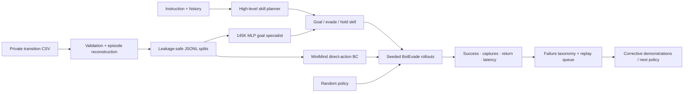

# MouseMind — A Tiny Language-Model Control Stack

[](https://github.com/hanshuo-shuo/MouseMind/actions/workflows/ci.yml)
[](LICENSE)
[](https://github.com/jingyaogong/minimind)

**A language-conditioned hierarchical Cellworld policy: verified legacy data,
a fast MLP controller, high-level safety planning, seeded closed-loop evaluation,
failure mining, latency profiling, and reproducible Slurm deployment.**

MouseMind turns a 64M-parameter MiniMind model into a 295-action mouse policy.
The point is not that an LLM must beat a specialist controller. The point is to
build and measure the complete ML system—data, model, evaluation, deployment
constraints, and the next data iteration—without hiding unfavorable baselines.

This is the standalone MouseMind repository, not a branch of the MiniMind
fork. Only the small, explicitly attributed MiniMind dependency closure needed
for reproduction is included.

[Technical documentation](mouse_llm/README.md) · [Public smoke demo](#run-the-public-demo) · [Verified result](#verified-offline-result)


| 74% hierarchical success | 80.99 fewer captures/episode vs MLP | 0.179 ms p95 policy latency |
| ---: | ---: | ---: |
| 95% CI 65–82% | paired over the same 100 seeds | local CPU, 0 deadline misses |

> The negative result is part of the design story: offline accuracy favored the
> 145K MLP, but 100-seed deployment exposed unsafe closed-loop behavior. That
> evidence motivated a hierarchical redesign instead of trying to make a 64M
> language model imitate a low-level numeric classifier.

## What I built

- Reconstructed 4,916 episodes from 118,861 legacy transitions using explicit
  terminals plus state-continuity boundaries.
- Prevented leakage with episode-level splits and serialized-prompt ownership
  across train, validation, and test.
- Extracted and packaged the BotEvade and Oasis Gymnasium environments with
  their minimal Cellworld runtime dependency closure.
- Adapted a 64.3M MiniMind checkpoint with a native-PyTorch LoRA path.
- Added a fair `10 → 256 → 256 → 295` MLP behavior-cloning specialist.
- Added free and token-constrained JSON decoding so output formatting can be
  separated from policy quality.
- Built paired closed-loop rollouts over identical seeds with bootstrap
  confidence intervals, return, success, capture, survival, path efficiency,
  p50/p95/p99 latency, action Hz, and control-deadline misses.
- Recovered the authoritative 2025 observation source and verified all ten
  fields with commit/blob hashes, full-dataset distribution checks, and signed
  angle state replay; formal reports now carry `research_evidence=true`.
- Added an instruction-conditioned high-level planner over the MLP goal
  specialist, with a temporal-history interface, replanning cadence, safety
  interrupts, and planner/controller latency accounting.
- Added deterministic failure taxonomy and replay-queue mining for targeted
  corrective demonstrations.
- Built private-data guards, synthetic CI, a public one-command demo, and Slurm
  pipelines for data preparation, training, evaluation, and benchmarking.

## What is upstream

The MiniMind architecture, tokenizer, base training code, and original model
utilities come from [jingyaogong/minimind](https://github.com/jingyaogong/minimind).
The extracted environment originates from my separate `Mice` project; its
vendored `cellworld_game` runtime retains its upstream MIT license. See
[environment provenance](mouse_llm/envs/mice/SOURCE.md) for exact commits and
local packaging changes.

This attribution boundary is intentional: MouseMind owns the policy-system
work listed above; it does not claim authorship of MiniMind.

The exact path-to-commit mapping and licenses are recorded in
[THIRD_PARTY_NOTICES.md](THIRD_PARTY_NOTICES.md). In this standalone repository,
`model/`, `trainer/`, and `dataset/lm_dataset.py` are the deliberately small
MiniMind dependency closure; the MouseMind system itself lives under
`mouse_llm/`.

## System



## System evolution

| Version | Evidence and decision |
| --- | --- |
| V0 — MiniMind BC | A 64M SLM can imitate held-out mouse actions: 41.0%. |
| V1 — Fair baseline + deployment | A 145K MLP wins offline at 55.7%, but reaches only 17% closed-loop success and averages 90.95 captures. |
| P1 — Hierarchical control | Keep the MLP as goal specialist; instruction-conditioned safety planning reaches 74% success and 9.96 captures. |
| V3 — Corrective data flywheel | Failure taxonomy and ranked replay manifests are ready; expert corrective labeling/retraining is next. |

## Run the public demo

The public demo exercises the exact closed-loop reporting path with a synthetic
arena and the real 295-action catalog. It needs no private data, checkpoint, or
Cellworld download:

```bash
git clone https://github.com/hanshuo-shuo/MouseMind.git
cd MouseMind
python -m pip install numpy pillow pytest
python demo.py
```

It writes paired episode records and aggregate metrics to
`/tmp/mousemind-public-demo/`. The report marks itself
`research_evidence=false`; its numbers are an engineering smoke test only.

Run the full public test suite and privacy check with:

```bash
python -m pytest mouse_llm/tests -q
python -m mouse_llm.privacy_guard
```

## Verified offline result

Quest job `19489` finished successfully in 5 minutes 44 seconds. It trained
0.393M LoRA parameters for two epochs / 3,750 optimizer steps on 60,000 private
training transitions. The 145,447-parameter MLP used the same 60K train split,
5K validation split, and deterministic 512-sample held-out subset.


| Held-out metric | Base MiniMind | Mouse-policy LoRA | MLP BC |
| --- | ---: | ---: | ---: |
| Strict JSON output | 0.0% | 100.0% | N/A—direct logits |
| Exact action accuracy | 0.0% | 41.0% (95% CI 36.9–45.3%) | **55.7%** (95% CI 51.4–60.0%) |
| Action-response NLL | 2.447 | **0.296** (95% CI 0.277–0.316) | N/A |
| Normalized destination error | 100.0% | 9.39% (95% CI 8.21–10.61%) | **2.23%** (95% CI 1.97–2.49%) |

The base model received maximum destination error because none of its free
generations satisfied the strict JSON contract. To address that credibility
confound, the evaluator now supports `--decode-mode json-constrained`; that
MiniMind rerun is still pending. The MLP result is the useful honest outcome:
for this single numeric task, the 145K-parameter specialist currently beats the
64M language-model policy on both exact action and destination error.

## Closed-loop benchmark contract

The online benchmark defaults to 100 paired seeds. Every policy is evaluated
under the same environment configuration and seed list.

| Policy | Offline action acc. | Survival | Capture rate | Success | Return | Path efficiency | p50 / p95 |
| --- | ---: | ---: | ---: | ---: | ---: | ---: | ---: |
| Random | — | 0.0% | 100.0% | 0.0% | -68.23 | 0.0% | 0.014 / 0.019 ms |
| MLP BC | **55.7%** | 1.0% | 99.0% | 17.0% | -90.78 | 7.29% | 0.138 / 0.180 ms |
| Hierarchical MLP, safety instruction | MLP controller | **15.0%** | **85.0%** | **74.0%** | **-9.22** | **26.13%** | 0.058 / 0.179 ms |
| MiniMind base, constrained | pending | pending | pending | pending | pending | pending | pending |
| MiniMind LoRA, constrained | pending | pending | pending | pending | pending | pending | pending |

The random/MLP rows are verified over the identical 100 local BotEvade seeds;
the hierarchical row uses those same seeds and the verified observation audit.
Against direct MLP, it improved success by 57 points (paired 95% CI 44–69),
reduced captures by 80.99 per episode (72.98–88.88), and improved return by
81.56 (73.27–89.28). This planner is the auditable instruction/rule baseline;
MiniMind planner and direct-action rows still require the existing Quest GPU
weights. Per-episode records remain private.

## Why use a language model?

For a single numeric control task, the MLP is the more parameter-efficient
specialist. Closed-loop deployment then showed its limitation: it can make goal
progress while repeatedly entering unsafe states. MouseMind therefore keeps the
MLP at the low-level controller and moves language/context to high-level skill
selection and replanning.

The intended comparison is therefore:

> a compact MLP specialist versus a small language-model generalist that can
> follow strategy instructions and share context across BotEvade and Oasis.

The checked-in P1 planner is an auditable instruction/paraphrase baseline, not a
claim that MiniMind already performs skill planning. It establishes the planner
API, history, safety interrupts, cadence, metrics, and training target. The next
model milestone is to post-train MiniMind on that verified skill-level contract.

## Repository map

```text
MouseMind/
├── mouse_llm/             original MouseMind policy/data/evaluation system
│   ├── baselines/         MLP behavior-cloning specialist
│   ├── data/              episode reconstruction and verified schema
│   ├── envs/mice/         BotEvade/Oasis runtime and provenance
│   ├── evaluation/        offline, closed-loop, audit, and failure mining
│   ├── hierarchical/      instruction planner + specialist controller
│   ├── northwestern/      reproducible Slurm jobs
│   ├── reports/           aggregate Git-safe evidence
│   └── tests/             synthetic contracts and privacy checks
├── model/                 upstream-derived MiniMind model + tokenizer
├── trainer/               upstream-derived MiniMind LoRA trainer
├── dataset/lm_dataset.py  upstream-derived SFT dataset adapter
├── THIRD_PARTY_NOTICES.md exact provenance and licenses
├── CITATION.cff           citation metadata
└── demo.py                dependency-light public evaluator demo
```

The detailed commands, storage layout, metric definitions, and limitations are
in [mouse_llm/README.md](mouse_llm/README.md).

## 中文摘要

MouseMind 是一个完整的 Cellworld policy 工程项目，而不只是一次 LoRA
微调。它覆盖私有轨迹审计、episode 防泄漏切分、MiniMind LoRA、MLP 公平
基线、受约束动作解码、seeded closed-loop 评估、延迟/控制周期分析、Slurm
和隐私 CI。

目前已验证的离线结果中，LoRA 在相同的 512 条 held-out transition 上达到
41.0% exact action accuracy，而仅 145K 参数的 MLP 达到 55.7%。这不是坏结果，
而是公平 baseline 的价值：单一数值控制任务上 specialist 更合适。随后在完全
相同的 100 个 closed-loop seeds 上，direct MLP 只有 17% success 且平均每局
90.95 次 capture；加入 instruction-conditioned safety planner 后，success 提升到
74%，capture 降到 9.96，p95 latency 仍为 0.179 ms。当前 planner 是可审计的
language/rule baseline，MiniMind skill planner 仍待 post-training，不会混为一谈。

## Citation and acknowledgements

If you use the MiniMind-derived model components, please cite the upstream
project using its requested citation:

```bibtex
@misc{minimind,
  title = {MiniMind: Train a Tiny LLM from Scratch},
  author = {Jingyao Gong},
  year = {2024},
  url = {https://github.com/jingyaogong/minimind},
  note = {GitHub repository}
}
```

To cite MouseMind itself, use the metadata in [CITATION.cff](CITATION.cff).
See [THIRD_PARTY_NOTICES.md](THIRD_PARTY_NOTICES.md) for the exact MiniMind and
Cellworld provenance boundary.

## License

MouseMind is released under Apache License 2.0. Upstream-derived MiniMind files
remain under Apache License 2.0; the vendored Cellworld runtime retains its MIT
notice in `mouse_llm/envs/mice/_vendor/LICENSE`.
