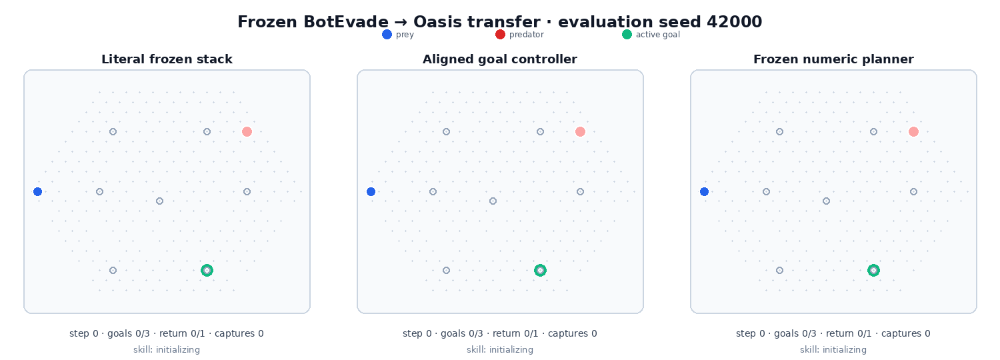
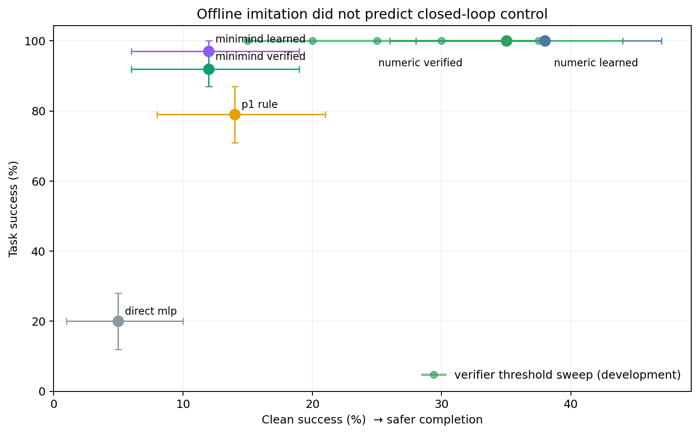
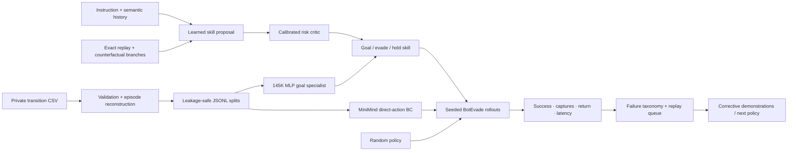

# MouseMind — Interface Before Intelligence

**A frozen cross-task study of representation, strategy, and closed-loop risk.**

MouseMind first showed that offline imitation accuracy did not predict
closed-loop control. The next question was harder: did the learned BotEvade
strategy transfer to the ordered multi-goal Oasis task?

The literal answer was no. BotEvade and Oasis share the same 295 actions, but
the frozen 10D specialist observes only goal distance—not the active goal
coordinates required by Oasis. Every literal full-stack policy reached **0%
task success** on 100 untouched final seeds.

After repairing only that interface with the same parameter-free active-goal
controller for every planner, the goal-only reference reached **100% task
success, 41% clean success, and 1.21 captures per episode**. Adding the frozen
P1, numeric, or MiniMind strategy reduced clean success to 5%, 3%, and 0% and
added 22.42, 19.15, and 31.18 captures per episode. Under unseen instructions,
MiniMind collapsed from 89% to 0% task success.

[Transfer study](TRANSFER_RESULTS.md) · [Technical guide](mouse_llm/README.md) · [Earlier learned-control result](P2_RESULTS.md) · [Public smoke demo](#run-the-public-demo)



The animation uses the predetermined first final seed (`42000`). The left panel
is the goal-only interface; the middle and right panels use identical MiniMind
weights with seen versus unseen instruction templates. Goal-only completes with
one capture; seen-instruction MiniMind visits all three goals but times out
before returning with 33 captures; unseen-instruction MiniMind completes no
goals and records 50 captures. This is a qualitative illustration—the claims
below come from the full paired 100-seed aggregate.


| Frozen transfer, 100 paired seeds | Task success | Objective completion | Clean success | Captures / episode |
| --- | ---: | ---: | ---: | ---: |
| Direct MLP, literal stack | 0% | 1.8% | 0% | 128.85 |
| Numeric planner, literal stack | 0% | 0.2% | 0% | 30.38 |
| **Goal controller, aligned** | **100%** | **100%** | **41%** | **1.21** |
| P1 rule planner, aligned | 98% | 99.5% | 5% | 23.63 |
| Numeric planner, aligned | 95% | 98.2% | 3% | 20.36 |
| MiniMind planner, aligned | 89% | 94.8% | 0% | 32.39 |

Against the aligned goal-only reference, paired 95% confidence intervals show
that every transferred planner made clean success worse: P1 by -36 points
(-47 to -25), numeric by -38 (-47 to -28), and MiniMind by -41 (-51 to -31).
The corresponding capture increases were +22.42 (19.36–25.62), +19.15
(14.53–25.02), and +31.18 (27.70–34.65) per episode.

> Thirty-second takeaway: a strategy cannot transfer through an insufficient
> interface, and restoring task completion does not establish strategic or safe
> transfer. The minimal controller beat every frozen learned planner.

## Earlier finding: offline accuracy did not predict control

A 145K behavior-cloning specialist achieved 55.7% held-out action accuracy but
only 17% historical closed-loop task success. A hand-coded hierarchy raised
that to 74%; a counterfactual 17.9K numeric planner later reached 100% task and
38% clean success on 100 untouched BotEvade seeds. A calibrated risk critic
scored 0.959 AUROC offline but worsened every closed-loop operating point and
was not promoted.



| BotEvade fresh ID, 100 paired seeds | Task success | Clean success | Capture rate | Captures / episode |
| --- | ---: | ---: | ---: | ---: |
| Numeric learned planner, K=8 | 100% | 38% | 62% | 2.66 |
| MiniMind learned planner | 97% | 12% | 88% | 7.37 |
| P1 rule hierarchy | 79% | 14% | 86% | 11.20 |
| Direct 145K MLP | 20% | 5% | 94% | 87.90 |

## What I built

- Reconstructed 4,916 episodes from 118,861 legacy transitions using explicit
  terminals plus state-continuity boundaries.
- Prevented leakage with episode-level splits and serialized-prompt ownership
  across train, validation, and test.
- Extracted and packaged the BotEvade and Oasis Gymnasium environments with
  their minimal Cellworld runtime dependency closure.
- Adapted a 64.3M MiniMind checkpoint with a native-PyTorch LoRA path.
- Added a fair `10 → 256 → 256 → 295` MLP behavior-cloning specialist.
- Added free and token-constrained JSON decoding so output formatting can be
  separated from policy quality.
- Built paired closed-loop rollouts over identical seeds with bootstrap
  confidence intervals, return, success, capture, survival, path efficiency,
  p50/p95/p99 latency, action Hz, and control-deadline misses.
- Recovered the authoritative 2025 observation source and verified all ten
  fields with commit/blob hashes, full-dataset distribution checks, and signed
  angle state replay; formal reports now carry `research_evidence=true`.
- Added an instruction-conditioned high-level planner over the MLP goal
  specialist, with a temporal-history interface, replanning cadence, safety
  interrupts, and planner/controller latency accounting.
- Froze disjoint collection/development/final seed pools and added clean success
  without changing the historical task-success definition.
- Collected 320 strategic anchors from rule, direct-MLP, and perturbed-skill
  trajectories; exact replay verified all 1,920 skill/horizon branches.
- Trained a 17.9K numeric planner, MiniMind skill LoRA, and a calibrated 17.7K
  capture-risk critic over the same semantic eight-step temporal context.
- Swept planner horizons and verifier thresholds on development only, rejected
  the verifier when it worsened every operating point, and evaluated the frozen
  system once on fresh ID and OOD conditions.
- Closed one P2.1 failure-data iteration; hard-failure upweighting worsened clean
  success from 52.5% to 45.0%, so the iteration was not selected.
- Audited BotEvade/Oasis transfer compatibility and failed closed on three
  hidden contract defects: non-deterministic Oasis resets, conflated success and
  survival semantics, and a default goal outside the discrete action threshold.
- Separated literal full-stack transfer from planner-isolation transfer, froze
  disjoint development/final pools, recorded source/checkpoint hashes, and ran
  100 paired final seeds without target training or final-seed selection.
- Added deterministic failure taxonomy and replay-queue mining for targeted
  corrective demonstrations.
- Built private-data guards, synthetic CI, a public one-command demo, Slurm
  pipelines, aggregate-only result generation, and a privacy-safe final-seed
  rollout animation.

## What is upstream

The MiniMind architecture, tokenizer, base training code, and original model
utilities come from [jingyaogong/minimind](https://github.com/jingyaogong/minimind).
The extracted environment originates from my separate `Mice` project; its
vendored `cellworld_game` runtime retains its upstream MIT license. See
[environment provenance](mouse_llm/envs/mice/SOURCE.md) for exact commits and
local packaging changes.

This attribution boundary is intentional: MouseMind owns the policy-system
work listed above; it does not claim authorship of MiniMind.

## System



## System evolution

| Version | Evidence and decision |
| --- | --- |
| V0 — Direct MiniMind BC | LoRA reaches 41.0% offline accuracy, but only 23% historical task / 1% clean success under valid constrained decoding. |
| V1 — Specialist deployment | A 145K MLP wins offline at 55.7%, but reaches only 17% historical closed-loop success. |
| P1 — Rule hierarchy | Keep the MLP as goal specialist; strategic abstraction reaches 74% historical success. |
| P2 — Learned hierarchy | Counterfactual numeric planning reaches 100% task / 38% clean success on 100 untouched final seeds. |
| P2 Verify | The critic is well calibrated offline but all runtime threshold points are worse; verifier not promoted. |
| P2.1 | Corrective hard-failure upweighting reduces development clean success; iteration rejected. |
| Transfer audit | Literal BotEvade-to-Oasis transfer is fail-closed: the 10D specialist lacks active goal coordinates. |
| Interface-aligned transfer | The minimal goal controller reaches 100% task / 41% clean success; every frozen planner reduces clean success and increases captures. |

## Run the public demo

The public demo exercises the exact closed-loop reporting path with a synthetic
arena and the real 295-action catalog. It needs no private data, checkpoint, or
Cellworld download:

```bash
python demo.py
```

It writes paired episode records and aggregate metrics to
`/tmp/mousemind-public-demo/`. The report marks itself
`research_evidence=false`; its numbers are an engineering smoke test only.

Run the full public test suite and privacy check with:

```bash
python -m pytest mouse_llm/tests -q
python -m mouse_llm.privacy_guard
```

## Verified offline result

Northwestern BCS516 Slurm job `19489` finished successfully in 5 minutes 44
seconds. It trained
0.393M LoRA parameters for two epochs / 3,750 optimizer steps on 60,000 private
training transitions. The 145,447-parameter MLP used the same 60K train split,
5K validation split, and deterministic 512-sample held-out subset.


| Held-out metric | Base MiniMind | Mouse-policy LoRA | MLP BC |
| --- | ---: | ---: | ---: |
| Strict JSON output | 0.0% | 100.0% | N/A—direct logits |
| Exact action accuracy | 0.0% | 41.0% (95% CI 36.9–45.3%) | **55.7%** (95% CI 51.4–60.0%) |
| Action-response NLL | 2.447 | **0.296** (95% CI 0.277–0.316) | N/A |
| Normalized destination error | 100.0% | 9.39% (95% CI 8.21–10.61%) | **2.23%** (95% CI 1.97–2.49%) |

The table preserves the original free-decoding run. A repaired explicit trie
decoder then made both MiniMind models 100% JSON-valid on the same 512 samples:
base reached 1.17% exact accuracy / 29.13% destination error, while LoRA retained
41.02% / 9.45%. Formatting therefore did not explain the policy-quality gap.
For this numeric task, the 145K specialist remained the stronger offline model.

## Closed-loop benchmark contract

The online benchmark defaults to 100 paired seeds. Every policy is evaluated
under the same environment configuration and seed list.

| Historical policy, seeds 1000..1099 | Task success | Clean success | Capture rate | Captures / episode |
| --- | ---: | ---: | ---: | ---: |
| Direct MiniMind base, constrained | 0% | 0% | 100% | 111.49 |
| Direct MiniMind LoRA, constrained | 23% | 1% | 99% | 96.92 |
| Direct MLP | 17% | pending recomputation | 99% | 90.95 |
| P1 rule hierarchy | 74% | pending recomputation | 85% | 9.96 |

The random/MLP rows are verified over the identical 100 local BotEvade seeds;
the hierarchical row uses those same seeds and the verified observation audit.
Against direct MLP, it improved success by 57 points (paired 95% CI 44–69),
reduced captures by 80.99 per episode (72.98–88.88), and improved return by
81.56 (73.27–89.28). Historical clean success for direct MLP and P1 is
intentionally pending because their old private episode rows are unavailable;
no value was inferred from separate success and capture marginals. Per-episode
records remain private.

## Why use a language model?

For a single numeric control task, the MLP is the more parameter-efficient
specialist. Closed-loop deployment then showed its limitation: it can make goal
progress while repeatedly entering unsafe states. MouseMind therefore keeps the
MLP at the low-level controller and moves language/context to high-level skill
selection and replanning.

The language model is therefore evaluated at the strategic layer, not used as a
needlessly expensive coordinate classifier. Skill LoRA improved offline planner
accuracy from 25.0% to 63.5% and reached 62.2% on frozen unseen paraphrases;
removing history reduced accuracy to 57.4%, and removing the instruction reduced
it to 50.7%. In fresh closed loop it reached 97% task success, demonstrating
useful learned strategy, but only 12% clean success. The numeric planner reached
38% clean success with sub-millisecond p95 latency. Language conditioning added
capability at this scale, but it did not win the control benchmark.

## Repository map

```text
mouse_llm/
├── baselines/             action BC and numeric temporal planner
├── data/                  reconstruction, anchors, counterfactual skill labels
├── envs/mice/             BotEvade/Oasis Gymnasium environments + provenance
├── evaluation/            offline, constrained-decoding, and closed-loop eval
├── hierarchical/          semantic context, planners, skills, risk verification
├── training/              skill-LoRA and compact risk-critic training
├── northwestern/p2/       reproducible collection/training/ID/OOD Slurm jobs
├── northwestern/transfer/ frozen BotEvade-to-Oasis jobs and merge contracts
├── reports/figures/       aggregate, Git-safe evidence only
├── tests/                 synthetic contracts and privacy checks
├── demo.py                dependency-light public evaluator demo
└── privacy_guard.py       rejects tracked data/checkpoints/weights
```

The detailed commands, storage layout, metric definitions, and limitations are
in [mouse_llm/README.md](mouse_llm/README.md).

## License

The repository retains MiniMind's Apache 2.0 license. Vendored Cellworld runtime
code retains its MIT notice in `mouse_llm/envs/mice/_vendor/LICENSE`.
