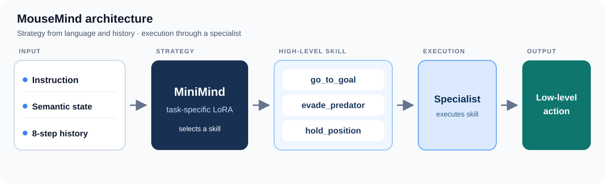

# MouseMind

MouseMind studies long-horizon mouse control in the Cellworld BotEvade task. Directly imitating low-level actions with MiniMind works poorly in closed loop: direct MiniMind LoRA succeeds on 26% of fresh paired test seeds. MouseMind instead separates strategic skill selection from low-level execution. A task-specific LoRA adapts MiniMind to read an instruction, the current semantic state, and eight steps of temporal history, then choose `go_to_goal`, `evade_predator`, or `hold_position`. Its training labels come from verified exact-state counterfactual rollouts of those skills, rather than copying historical actions. A specialist executes the chosen skill as a low-level action. **Verified DPO LoRA is the best tested language planner:** 100% task success, 22% clean success, and 4.94 captures per episode on the fixed 100-seed final-ID pool. **The published LoRA SFT hierarchy is the lower-resource option** when that extra safety gain is not required. Full-parameter DPO and GRPO did not improve the closed-loop result.

## Core idea



MiniMind decides what to do; the specialist decides how to execute it. The goal-progress specialist is an MLP behavior-cloning policy. **Verified DPO is still this same hierarchical method and still uses LoRA**: it starts from a separately retrained SFT skill-planner LoRA, updates that adapter with verified preference pairs, and uses a frozen copy of the SFT adapter as its reference. The MiniMind backbone, three-skill JSON interface, and specialist are unchanged. The P1 rule hierarchy is a separate rule baseline, not a learned MiniMind policy.

## Why hierarchy?

Historical action labels need not be optimal, and one-step imitation accuracy does not ensure closed-loop success. Direct low-level MiniMind must handle semantic and temporal reasoning together with motor control. The hierarchy gives MiniMind the strategic decision and delegates action execution to controllers.

## Data and supervision

```text
118,861 transitions → strict validation → 4,916 reconstructed episodes
                   → episode-isolated train/val/test splits
                   → serialized-prompt deduplication
```

Planner supervision starts from exactly replayable anchor states. For each requested preference, the pipeline executes candidate skills from the same state, measures short-horizon outcomes, and selects the best skill as the MiniMind SFT target. The training collection contains **320 anchors** and **1,920 verified counterfactual branches** at horizons **4 and 8**. Labels are grounded in verified replay, not historical action frequency. The [technical guide](mouse_llm/README.md) documents the validation and observation contracts.

## Main results

All rows use the same 100 paired BotEvade final-ID seeds, excluded from training. Multiple variants were evaluated on this fixed pool, so the comparison is exploratory rather than a one-shot blind test. Task success means reaching the goal; clean success additionally requires no capture; capture rate is the share of episodes with at least one capture. The numeric planner is a **non-language upper reference**. The published SFT LoRA is the main SFT result; Verified DPO was initialized from a separately retrained seed-isolated SFT LoRA, detailed in the [DPO report](VERIFIED_DPO_RESULTS.md).

| Policy | Planner training | Task success ↑ | Clean success ↑ | Capture rate ↓ | Captures / episode ↓ |
| --- | --- | ---: | ---: | ---: | ---: |
| Direct MiniMind | Flat action LoRA | 26% | 1% | 99% | 98.60 |
| Direct MLP BC | Flat action imitation | 20% | 5% | 94% | 87.90 |
| P1 rule hierarchy | Rule baseline | 79% | 14% | 86% | 11.20 |
| MiniMind without history | Hierarchical LoRA ablation | 80% | 1% | 99% | 13.15 |
| MiniMind without instruction | Hierarchical LoRA ablation | 80% | 1% | 99% | 13.15 |
| **Published MiniMind hierarchy** | **SFT LoRA · lower resource** | **97%** | **12%** | **88%** | **7.37** |
| Full-parameter MiniMind hierarchy | Full SFT, seed-isolated data | 95% | 18% | 82% | 5.41 |
| **Verified DPO skill planner, β=0.1** | **SFT LoRA → DPO LoRA · best language planner** | **100%** | **22%** | **78%** | **4.94** |
| Verified DPO skill planner, β=0.1 | Full SFT → full DPO | 80% | 1% | 99% | 13.09 |
| Verified GRPO skill planner | SFT LoRA → GRPO LoRA | 80% | 1% | 99% | 13.15 |
| Verified GRPO skill planner | Full SFT → full GRPO | 85% | 1% | 99% | 11.62 |
| Numeric planner | Non-language upper reference | 100% | 38% | 62% | 2.66 |

**Why use LoRA DPO for the main result?** It keeps the same MiniMind → skill → specialist hierarchy and continues training a seed-isolated SFT LoRA with exact-state verified preference pairs. Against its own SFT initialization (92% task success, 8% clean success, 92% capture rate, 8.94 captures per episode), task success improves by 8 percentage points, clean success by 14 points, capture rate falls by 14 points, and captures per episode fall by 4.00. The paired 95% confidence intervals for all four changes exclude zero. The published SFT LoRA above is a matched-evaluation historical reference, not DPO's initialization. LoRA DPO reaches the best tested combination of task completion and capture reduction among the language planners; the numeric reference remains stronger on clean success and captures.

**Why keep published LoRA SFT as the resource-conscious option?** It needs only the SFT stage and trains 393,216 skill-planner parameters (0.62% of MiniMind's 63,912,192). Its adapter checkpoint is about 0.8 MB versus about 275 MB for a full checkpoint; fewer trainable parameters also reduce optimizer-state storage. It achieves 97% task success, 12% clean success, and 7.37 captures per episode, while LoRA DPO provides the stronger measured safety result after an additional preference-training stage. The separately retrained seed-isolated SFT baseline remains in the detailed reports for a valid controlled DPO comparison.

Full-parameter DPO and GRPO both drift toward `evade_predator`: it occupies 99.8% and 97.4% of final-ID executed skill steps, respectively, versus 86.7% for full SFT and 68.0% for LoRA DPO. That observed shift accompanies lower task success and more captures; it is a plausible explanation, not proof of a unique cause. See [Verified DPO results](VERIFIED_DPO_RESULTS.md) for paired LoRA estimates, [full-parameter experiment](FULL_FINETUNE_EXPERIMENT.md) for the new run, [P2 results](P2_RESULTS.md) for original ablations and OOD, and [Verified RLVR summary](VERIFIED_ALIGNMENT_RESULTS.md) for the earlier GRPO and longer-training runs.

## What MiniMind contributes

General-purpose MiniMind does not know the three mouse-skill semantics on its own. Without task LoRA, the skill planner had **25% offline skill accuracy** and collapsed toward `hold_position`; task-specific LoRA raised unseen-paraphrase skill accuracy to **62.2%**. The full hierarchy then reached **97% closed-loop task success**. No closed-loop success claim is made for the unadapted skill planner.

## Implementation highlights

- 64M-class MiniMind with task-specific LoRA for strategic skill selection.
- Semantic state and eight-step temporal context.
- Constrained JSON decoding over the three skills.
- MLP BC specialist for goal progress.
- Exact-state replay for counterfactual training labels.
- Seed-isolated Verified DPO and modular exact-replay GRPO experiments over the same three-skill policy.
- Paired seeded closed-loop evaluation.

## Quick start

From a checkout of this repository, install the project and environment dependencies, then run the public synthetic demo:

```bash
python -m pip install -e '.[env]'
python demo.py
```

The demo exercises the evaluation path and action catalog; it does **not** reproduce the research results. A full BotEvade evaluation requires the separately stored model checkpoints and Cellworld cache. With those paths set, the main paired comparison is:

```bash
python -m mouse_llm.evaluation.p2_benchmark \
  --policies direct-minimind-lora minimind-learned \
  --reference-policy direct-minimind-lora \
  --seed-pool final_id_test --ood id --planner-horizon 8 \
  --mlp-checkpoint "$MOUSE_LLM_MLP_CHECKPOINT" \
  --base-weight "$MOUSE_LLM_BASE_WEIGHT" \
  --direct-lora-weight "$MOUSE_LLM_DIRECT_LORA_WEIGHT" \
  --skill-lora-weight "$MOUSE_P2_SKILL_LORA_WEIGHT" \
  --tokenizer model --device cuda --output-dir "$MOUSE_P2_OUTPUT_ROOT/final_id"
```

Set `CELLWORLD_CACHE` to the local environment cache before the full evaluation. Point `MOUSE_P2_SKILL_LORA_WEIGHT` at the Verified DPO β=0.1 adapter for the recommended result, or at the published SFT adapter for the lower-resource baseline. The [P2 runbook](mouse_llm/northwestern/p2/RUNBOOK.md) gives the full cluster setup and checkpoint workflow.

## Repository structure

| Path | Purpose |
| --- | --- |
| `mouse_llm/data` | Validates and reconstructs trajectories; builds counterfactual skill labels. |
| `mouse_llm/hierarchical` | Semantic context, skill planning, and execution. |
| `mouse_llm/baselines` | Direct action and numeric planner baselines. |
| `mouse_llm/evaluation` | Offline, alignment, and seeded closed-loop evaluation. |
| `mouse_llm/training` | Task-specific planner and specialist training. |
| `mouse_llm/verified_rl` | Shared utility reward, exact-state branching, and constrained skill sampling for GRPO. |
| `model` | MiniMind architecture and tokenizer assets. |
| `trainer` | MiniMind training utilities. |

## Limitations

- The full MiniMind hierarchy still trails the numeric planner on clean success and captures.
- Performance degrades on unseen-language conditions.
- The three-skill vocabulary is hand-designed and small.
- Short-horizon verified reward did not translate into a better closed-loop GRPO policy in these runs; the policy shifted toward `evade_predator` and lost task success. Full-parameter DPO and GRPO also degraded relative to their full SFT initialization. The longer LoRA DPO configuration degraded on development seeds.
- Execution depends on task-specific specialists.

A corrective hard-example iteration was tested and rejected because it worsened closed-loop performance; details are in [P2 results](P2_RESULTS.md).

## Reproducibility and detailed docs

- [Technical guide](mouse_llm/README.md): data preparation, observation-contract audit, private-data handling, metric definitions, and historical experiments.
- [P2 results](P2_RESULTS.md): full benchmark, verifier sweep, corrective iteration, and failure analysis.
- [Oracle analysis](ORACLE_ANALYSIS.md) and [transfer study](TRANSFER_RESULTS.md): upper references and Oasis transfer.
- [P2 cluster runbook](mouse_llm/northwestern/p2/RUNBOOK.md) and [transfer runbook](mouse_llm/northwestern/transfer/RUNBOOK.md): Northwestern Slurm procedures.
- [Environment provenance](mouse_llm/envs/mice/SOURCE.md) and [third-party notices](THIRD_PARTY_NOTICES.md): source history and licenses.

MiniMind architecture and base training utilities come from [jingyaogong/minimind](https://github.com/jingyaogong/minimind). The repository retains MiniMind's Apache 2.0 license; the vendored Cellworld runtime retains its MIT notice.
