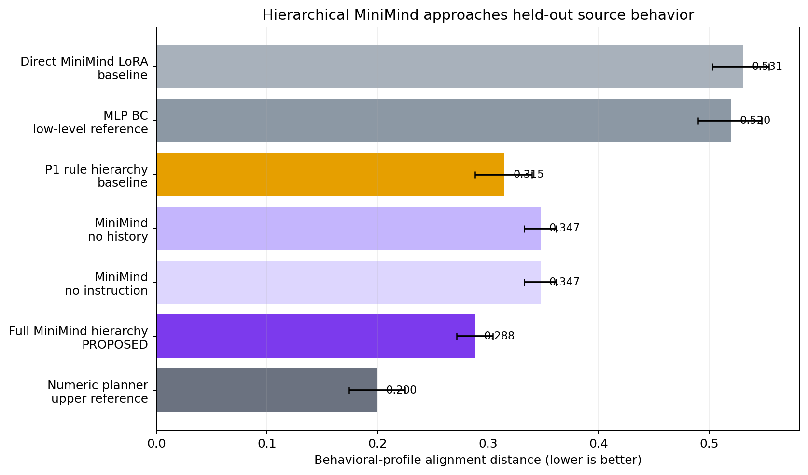
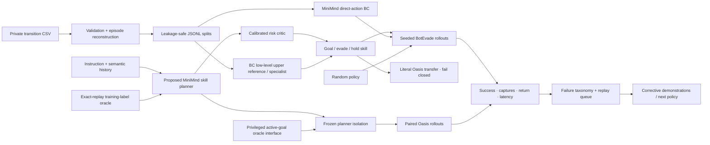
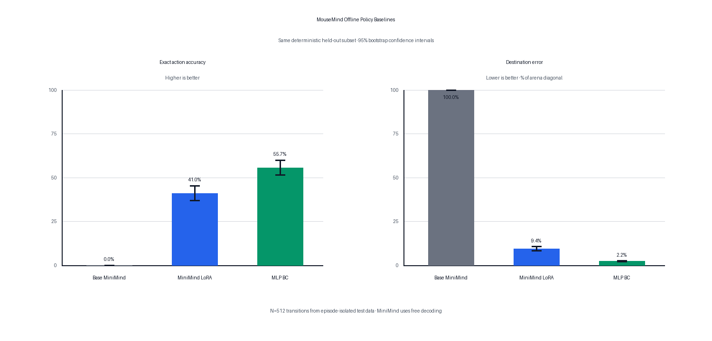

# MouseMind — Learning Strategy Under Closed-Loop Risk

**A MiniMind language policy became useful when control was moved from direct
actions to hierarchical strategy.**

Direct MiniMind LoRA reached **26% task / 1% clean success** on fresh BotEvade
seeds. The proposed MiniMind hierarchy instead uses language and temporal
context to choose among three strategic skills while a compact BC specialist
executes goal motion. It reached **97% task / 12% clean success** and reduced
captures from 98.60 to 7.37 per episode. The paired gains versus direct
MiniMind were +71 task points, +11 clean points, and −91.23 captures per
episode.

Removing either temporal history or instruction conditioning reduced the
MiniMind hierarchy to **80% task / 1% clean success**, directly supporting the
proposed structure. Stronger non-language and privileged-information systems
are retained as upper references: the numeric planner reached 100% / 38%, and
the aligned Oasis goal-coordinate oracle reached 100% / 41%. They quantify the
remaining oracle gap rather than being presented as the proposed method.

[Technical guide](mouse_llm/README.md) · [P2 results](P2_RESULTS.md) · [Oracle analysis](ORACLE_ANALYSIS.md) · [Transfer study](TRANSFER_RESULTS.md) · [Trajectory alignment](TRAJECTORY_ALIGNMENT.md) · [Action alignment](MOUSE_ALIGNMENT.md) · [Public smoke demo](#run-the-public-demo)



| Role, fresh ID (100 paired seeds) | Task success | Clean success | Captures / episode |
| --- | ---: | ---: | ---: |
| Baseline — direct MiniMind LoRA | 26% | 1% | 98.60 |
| Baseline — direct MLP BC | 20% | 5% | 87.90 |
| Baseline — P1 rule hierarchy | 79% | 14% | 11.20 |
| Ablation — MiniMind without history | 80% | 1% | 13.15 |
| Ablation — MiniMind without instruction | 80% | 1% | 13.15 |
| **Proposed — full MiniMind hierarchy** | **97%** | **12%** | **7.37** |
| Upper reference — numeric planner | 100% | 38% | 2.66 |

On a separate 11-feature behavioral-profile alignment audit, full MiniMind is
the best MiniMind variant at **0.288** (lower is better), versus 0.531 for
direct MiniMind LoRA, 0.347 for either structural ablation, and 0.315 for P1.
The numeric non-language upper reference reaches 0.200. See the full
[role definitions, paired deltas, and oracle gaps](ORACLE_ANALYSIS.md).

> Thirty-second takeaway: the MiniMind contribution is hierarchical strategy,
> not direct coordinate prediction. The full language-conditioned hierarchy
> strongly outperforms direct MiniMind and both structural ablations; specialist,
> numeric, and privileged goal systems are reported afterward as upper
> references that expose remaining headroom.

## What I built

- Reconstructed 4,916 episodes from 118,861 legacy transitions using explicit
  terminals plus state-continuity boundaries.
- Prevented leakage with episode-level splits and serialized-prompt ownership
  across train, validation, and test.
- Extracted and packaged the BotEvade and Oasis Gymnasium environments with
  their minimal Cellworld runtime dependency closure.
- Adapted a 64.3M MiniMind checkpoint with a native-PyTorch LoRA path.
- Added a fair `10 → 256 → 256 → 295` MLP behavior-cloning specialist.
- Added free and token-constrained JSON decoding so output formatting can be
  separated from policy quality.
- Added a source-trajectory alignment audit on the identical frozen held-out
  states, including predator-visible/hidden strata and action-distribution shift.
- Added a complete behavioral-profile alignment audit over 500 held-out source
  episodes and an explicit baseline/proposed/oracle comparison taxonomy.
- Built paired closed-loop rollouts over identical seeds with bootstrap
  confidence intervals, return, success, capture, survival, path efficiency,
  p50/p95/p99 latency, action Hz, and control-deadline misses.
- Recovered the authoritative 2025 observation source and verified all ten
  fields with commit/blob hashes, full-dataset distribution checks, and signed
  angle state replay; formal reports now carry `research_evidence=true`.
- Added an instruction-conditioned high-level planner over the MLP goal
  specialist, with a temporal-history interface, replanning cadence, safety
  interrupts, and planner/controller latency accounting.
- Froze disjoint collection/development/final seed pools and added clean success
  without changing the historical task-success definition.
- Collected 320 strategic anchors from rule, direct-MLP, and perturbed-skill
  trajectories; exact replay verified all 1,920 skill/horizon branches.
- Trained a 17.9K numeric planner, MiniMind skill LoRA, and a calibrated 17.7K
  capture-risk critic over the same semantic eight-step temporal context.
- Swept planner horizons and verifier thresholds on development only, rejected
  the verifier when it worsened every operating point, and evaluated the frozen
  system once on fresh ID and OOD conditions.
- Closed one P2.1 failure-data iteration; hard-failure upweighting worsened clean
  success from 52.5% to 45.0%, so the iteration was not selected.
- Audited BotEvade/Oasis transfer compatibility and failed closed on
  non-deterministic resets, conflated terminal semantics, and an unreachable
  discrete goal.
- Separated literal full-stack transfer from planner-isolation transfer and ran
  both on 100 untouched paired Oasis seeds without target training.
- Added deterministic failure taxonomy and replay-queue mining for targeted
  corrective demonstrations.
- Built private-data guards, synthetic CI, a public one-command demo, Slurm
  pipelines, aggregate-only publication, and a privacy-safe rollout animation.

## What is upstream

The MiniMind architecture, tokenizer, base training code, and original model
utilities come from [jingyaogong/minimind](https://github.com/jingyaogong/minimind).
The extracted environment originates from my separate `Mice` project; its
vendored `cellworld_game` runtime retains its upstream MIT license. See
[environment provenance](mouse_llm/envs/mice/SOURCE.md) for exact commits and
local packaging changes.

This attribution boundary is intentional: MouseMind owns the policy-system
work listed above; it does not claim authorship of MiniMind.

## System



## System evolution

| Version | Evidence and decision |
| --- | --- |
| V0 — Direct MiniMind BC | LoRA reaches 41.0% offline accuracy, but only 23% historical task / 1% clean success under valid constrained decoding. |
| V1 — Specialist deployment | A 145K MLP wins offline at 55.7%, but reaches only 17% historical closed-loop success. |
| P1 — Rule hierarchy | Keep the MLP as goal specialist; strategic abstraction reaches 74% historical success. |
| **P2 — Proposed MiniMind hierarchy** | Language-conditioned strategy reaches 97% task / 12% clean success, versus 26% / 1% for direct MiniMind; history and instruction ablations fall to 80% / 1%. |
| P2 upper reference | The non-language numeric planner reaches 100% task / 38% clean success and defines remaining high-level headroom. |
| P2 Verify | The critic is well calibrated offline but all runtime threshold points are worse; verifier not promoted. |
| P2.1 | Corrective hard-failure upweighting reduces development clean success; iteration rejected. |
| Transfer audit | Literal BotEvade-to-Oasis transfer fails closed because the frozen 10D specialist lacks active goal coordinates. |
| Target oracle analysis | The goal-coordinate controller reaches 100% task / 41% clean success; frozen planners expose a large remaining transfer gap. |

## Run the public demo

The public demo exercises the exact closed-loop reporting path with a synthetic
arena and the real 295-action catalog. It needs no private data, checkpoint, or
Cellworld download:

```bash
python demo.py
```

It writes paired episode records and aggregate metrics to
`/tmp/mousemind-public-demo/`. The report marks itself
`research_evidence=false`; its numbers are an engineering smoke test only.

Run the full public test suite and privacy check with:

```bash
python -m pytest mouse_llm/tests -q
python -m mouse_llm.privacy_guard
```

## Verified offline result

Northwestern BCS516 Slurm job `19489` finished successfully in 5 minutes 44
seconds. It trained
0.393M LoRA parameters for two epochs / 3,750 optimizer steps on 60,000 private
training transitions. The 145,447-parameter MLP used the same 60K train split,
5K validation split, and deterministic 512-sample held-out subset.



| Held-out metric | Base MiniMind | Mouse-policy LoRA | MLP BC |
| --- | ---: | ---: | ---: |
| Strict JSON output | 0.0% | 100.0% | N/A—direct logits |
| Exact action accuracy | 0.0% | 41.0% (95% CI 36.9–45.3%) | **55.7%** (95% CI 51.4–60.0%) |
| Action-response NLL | 2.447 | **0.296** (95% CI 0.277–0.316) | N/A |
| Normalized destination error | 100.0% | 9.39% (95% CI 8.21–10.61%) | **2.23%** (95% CI 1.97–2.49%) |

The table preserves the original free-decoding run. A repaired explicit trie
decoder then made both MiniMind models 100% JSON-valid on the same 512 samples:
base reached 1.17% exact accuracy / 29.13% destination error, while LoRA retained
41.02% / 9.45%. Formatting therefore did not explain the policy-quality gap.
For this numeric task, the 145K specialist remained the stronger offline model.

## Source mouse trajectory alignment

This is a low-level teacher-forced component diagnostic on the same 512
held-out source states. Full hierarchies are evaluated in the separate
[trajectory-profile alignment](TRAJECTORY_ALIGNMENT.md).

| Policy | Overall action agreement | Predator hidden (N=492) | Predator visible (N=20) | Destination error | Action-distribution JS |
| --- | ---: | ---: | ---: | ---: | ---: |
| Base MiniMind, constrained | 1.2% | 1.2% | 0.0% | 29.1% | 0.954 bits |
| Mouse-policy LoRA, constrained | 41.0% | 41.1% | 40.0% | 9.4% | 0.238 bits |
| MLP BC, low-level upper reference | **55.7%** | **56.5%** | 35.0% | **2.2%** | **0.128 bits** |

The MLP is the closest overall match to the source action labels and action
distribution. The predator-visible stratum contains only 20 samples, so the
MLP/LoRA ordering there is not resolved: their 95% intervals are 15–55% and
20–60%, respectively. Full intervals, definitions, and limitations are in
[MOUSE_ALIGNMENT.md](MOUSE_ALIGNMENT.md); the aggregate evidence is
[source_mouse_alignment.json](mouse_llm/reports/source_mouse_alignment.json).
The legacy file is a BotEvade simulator-policy export, not biological mouse
behavior, and one-step agreement is not a safety claim.

## Closed-loop benchmark contract

The online benchmark defaults to 100 paired seeds. Every policy is evaluated
under the same environment configuration and seed list.

| Historical policy, seeds 1000..1099 | Task success | Clean success | Capture rate | Captures / episode |
| --- | ---: | ---: | ---: | ---: |
| Direct MiniMind base, constrained | 0% | 0% | 100% | 111.49 |
| Direct MiniMind LoRA, constrained | 23% | 1% | 99% | 96.92 |
| Direct MLP | 17% | pending recomputation | 99% | 90.95 |
| P1 rule hierarchy | 74% | pending recomputation | 85% | 9.96 |

The random/MLP rows are verified over the identical 100 local BotEvade seeds;
the hierarchical row uses those same seeds and the verified observation audit.
Against direct MLP, it improved success by 57 points (paired 95% CI 44–69),
reduced captures by 80.99 per episode (72.98–88.88), and improved return by
81.56 (73.27–89.28). Historical clean success for direct MLP and P1 is
intentionally pending because their old private episode rows are unavailable;
no value was inferred from separate success and capture marginals. Per-episode
records remain private.

## Why use a language model?

For a single numeric control task, the MLP is the more parameter-efficient
specialist. Closed-loop deployment then showed its limitation: it can make goal
progress while repeatedly entering unsafe states. MouseMind therefore keeps the
MLP at the low-level controller and moves language/context to high-level skill
selection and replanning.

The proposed MiniMind model is therefore evaluated at the strategic layer, not
as an expensive coordinate classifier. Skill LoRA improved offline planner
accuracy from 25.0% to 63.5% and reached 62.2% on frozen unseen paraphrases. In
fresh closed loop, the full hierarchy reached 97% task / 12% clean success;
removing either history or instruction reduced it to 80% / 1%. Relative to
direct MiniMind LoRA, the hierarchy adds 71 task points and removes 91.23
captures per episode.

The numeric planner remains a non-language upper reference at 100% task / 38%
clean success. This gap is reported explicitly in the oracle analysis. The
supported contribution is that MiniMind becomes an effective, instruction-aware
strategic controller through the hierarchical design—not that language
generation is intrinsically superior to numeric control.

## Oracle analysis: Interface Before Intelligence

The frozen cross-task study asks whether the learned BotEvade strategy transfers
to the ordered multi-goal Oasis task. This analysis is placed after the proposed
MiniMind result because it is an oracle-gap study, not the main-method ranking.

BotEvade and Oasis share the same 295 actions, but the frozen 10D specialist
observes only goal distance—not the active goal coordinates required by Oasis.
Every literal full-stack policy therefore reached **0% task success** on 100
untouched final seeds. This is a fail-closed interface result.

After repairing only that interface with the same parameter-free active-goal
controller for every planner, the privileged goal-only reference reached
**100% task success, 41% clean success, and 1.21 captures per episode**.

<p align="center">
  
</p>

[Open the animation directly](mouse_llm/reports/figures/transfer_rollout.gif).

| Frozen Oasis transfer, 100 paired seeds | Task success | Objective completion | Clean success | Captures / episode |
| --- | ---: | ---: | ---: | ---: |
| Direct MLP, literal stack | 0% | 1.8% | 0% | 128.85 |
| Numeric planner, literal stack | 0% | 0.2% | 0% | 30.38 |
| **Goal-coordinate oracle** | **100%** | **100%** | **41%** | **1.21** |
| P1 rule planner, aligned | 98% | 99.5% | 5% | 23.63 |
| Numeric planner, aligned | 95% | 98.2% | 3% | 20.36 |
| MiniMind planner, aligned | 89% | 94.8% | 0% | 32.39 |

Against the goal-coordinate oracle, paired intervals show remaining gaps for
every transferred strategy. MiniMind is −11 task points (95% CI −17 to −5),
−41 clean points (−51 to −31), and +31.18 captures per episode (+27.70 to
+34.65). Under unseen instructions, MiniMind falls from 89% to 0% Oasis task
success. These results define the next-model target without changing the source
task claim. The complete protocol is in [TRANSFER_RESULTS.md](TRANSFER_RESULTS.md).

## Repository map

```text
mouse_llm/
├── baselines/             action BC and numeric temporal planner
├── data/                  reconstruction, anchors, counterfactual skill labels
├── envs/mice/             BotEvade/Oasis Gymnasium environments + provenance
├── evaluation/            offline, alignment, constrained-decoding, closed-loop eval
├── hierarchical/          semantic context, planners, skills, risk verification
├── training/              skill-LoRA and compact risk-critic training
├── northwestern/p2/       reproducible collection/training/ID/OOD Slurm jobs
├── northwestern/transfer/ frozen BotEvade-to-Oasis jobs and merge contracts
├── reports/figures/       aggregate, Git-safe evidence only
├── tests/                 synthetic contracts and privacy checks
├── demo.py                dependency-light public evaluator demo
└── privacy_guard.py       rejects tracked data/checkpoints/weights
```

The detailed commands, storage layout, metric definitions, and limitations are
in [mouse_llm/README.md](mouse_llm/README.md).


## License

The repository retains MiniMind's Apache 2.0 license. Vendored Cellworld runtime
code retains its MIT notice in `mouse_llm/envs/mice/_vendor/LICENSE`.
