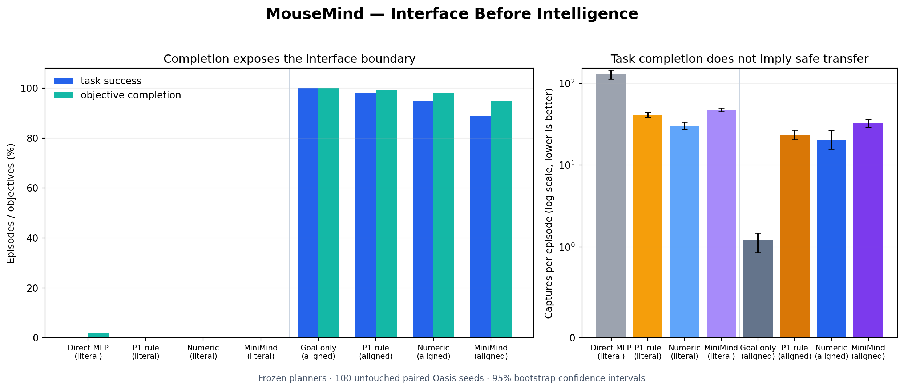

# MouseMind — Interface Before Intelligence

## Research question

Do high-level strategies learned in single-goal BotEvade transfer to the ordered multi-goal Oasis task, or are the P2 gains tied to the original low-level interface and task geometry?

## Frozen evaluation contract

- Source: BotEvade `21_05`; target: discrete-compatible Oasis `21_05`.
- Final evidence: 100 untouched paired seeds, three sampled ordered goals, then return to start.
- No target training, target adaptation, threshold selection, or final-seed tuning.
- Literal transfer reuses the frozen P2 planner and 10D specialist unchanged.
- Planner-isolation transfer freezes the high-level planner and gives every planner the same parameter-free active-goal controller.

## Main result

The target-task interface restored completion, but none of the frozen strategic planners improved the primary clean-success objective over the aligned goal-only controller.

  

[Open the animation directly](mouse_llm/reports/figures/transfer_rollout.gif).

The animation uses the predetermined first final seed (`42000`). The left panel is the goal-only interface; the other panels use identical MiniMind weights with seen versus unseen instruction templates. Goal-only completes with one capture; seen-instruction MiniMind visits all goals but times out before returning with 33 captures; unseen-instruction MiniMind completes no goals and records 50 captures. This is qualitative—claims and intervals come from the 100-seed aggregate.

| Policy | Task success | Objective completion | Clean success | Captures / episode | Path efficiency |
| --- | ---: | ---: | ---: | ---: | ---: |
| Random | 0.0% | 3.8% | 0.0% | 138.87 | 0.0% |
| Direct MLP (literal stack) | 0.0% | 1.8% | 0.0% | 128.85 | 0.0% |
| P1 rule planner (literal stack) | 0.0% | 0.0% | 0.0% | 41.06 | 0.0% |
| Numeric planner (literal stack) | 0.0% | 0.2% | 0.0% | 30.38 | 0.0% |
| MiniMind planner (literal stack) | 0.0% | 0.2% | 0.0% | 47.23 | 0.0% |
| Goal controller (aligned) | 100.0% | 100.0% | 41.0% | 1.21 | 96.7% |
| P1 rule planner (aligned) | 98.0% | 99.5% | 5.0% | 23.63 | 17.8% |
| Numeric planner (aligned) | 95.0% | 98.2% | 3.0% | 20.36 | 14.3% |
| MiniMind planner (aligned) | 89.0% | 94.8% | 0.0% | 32.39 | 9.8% |

## What the compatibility audit changed

- BotEvade and Oasis share all 295 action destinations exactly (`8d2c7a70bb9a…`).
- The original Oasis wrapper did not provide deterministic seeded resets and conflated task success with zero-capture survival; both contracts are now explicit and tested.
- One default Oasis goal was 0.046875 from its nearest discrete action, beyond the 0.025 completion threshold. The frozen discrete-compatible contract projects that goal once before evaluation and records the change.
- The frozen BotEvade 10D specialist observes goal distance but not active goal coordinates. Literal full-stack transfer is therefore reported as an intentional fail-closed baseline, not as a valid planner-transfer test.

## Transfer findings

- The best literal full-stack task success was 0.0%.
- The strongest aligned system was Goal controller (aligned) at 100.0% task success, 41.0% clean success, and 1.21 captures per episode.
- The aligned goal-only reference reached 100.0% task success and 41.0% clean success.
- P1 rule planner (aligned) changed clean success by -36.0 points (95% CI -47.0 to -25.0) and captures by +22.42 per episode (+19.36 to +25.62) relative to the aligned goal-only controller.
- Numeric planner (aligned) changed clean success by -38.0 points (95% CI -47.0 to -28.0) and captures by +19.15 per episode (+14.53 to +25.02) relative to the aligned goal-only controller.
- MiniMind planner (aligned) changed clean success by -41.0 points (95% CI -51.0 to -31.0) and captures by +31.18 per episode (+27.70 to +34.65) relative to the aligned goal-only controller.

## Unseen-instruction ablations

- MiniMind planner (aligned): 0.0% task success, 0.0% clean success, 46.49 captures per episode.
- MiniMind without history (aligned): 0.0% task success, 0.0% clean success, 49.94 captures per episode.
- MiniMind without instruction (aligned): 0.0% task success, 0.0% clean success, 52.72 captures per episode.

## Interpretation and limitations

This experiment separates interface compatibility from strategic transfer. Restoring access to the active target can recover task completion without proving that the learned safety strategy transferred. Task success and clean success remain separate, and no policy is described as safe from completion alone.

The study uses one public Cellworld geometry with a new multi-goal task, not a new physical world. Cross-geometry transfer remains unsupported until its action and geometry contracts are verified independently.

## Resume-ready summary

> Built a fail-closed BotEvade-to-Oasis transfer study over 100 untouched paired seeds; identified and repaired seeded-reset, terminal-semantics, and discrete-goal contract defects; separated literal full-stack transfer from planner-isolation transfer; and showed that the best literal stack reached 0.0% task success while Goal controller (aligned) reached 100.0% task / 41.0% clean success under the verified target interface.
