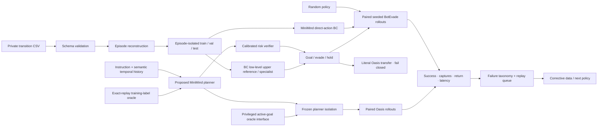
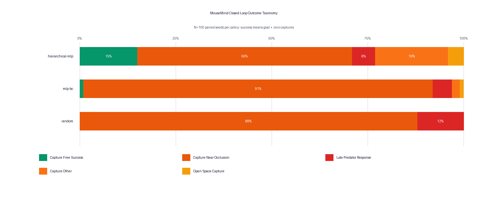
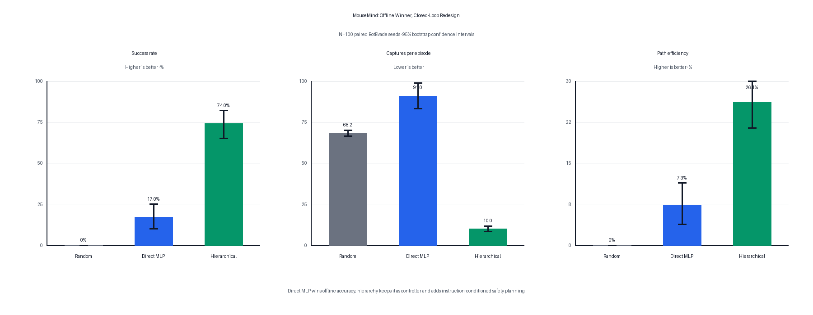

# MouseMind Technical Guide

MouseMind is an end-to-end policy engineering project built around a
64M-parameter MiniMind model and the BotEvade/Oasis Cellworld environments. It
covers private trajectory reconstruction, leakage-safe behavior cloning,
conventional and language-model policies, offline and closed-loop evaluation,
deployment latency, Slurm execution, and privacy enforcement.

The project separates three evidence levels:

| Label | Meaning | Publish as a policy result? |
| --- | --- | ---: |
| `research_evidence=true` | private held-out or real seeded environment run | yes, with the full contract |
| `research_evidence=false` | public synthetic pipeline/evaluator smoke test | no |
| `pending` | code exists but the corresponding run has not completed | no |

## Current status

- **Verified:** offline MiniMind base/LoRA and MLP evaluation on the identical
  deterministic 512-transition subset from episode-isolated test data.
- **Verified:** aggregate-only source-trajectory alignment on those same 512
  states, including predator-visible/hidden agreement and action-distribution
  Jensen–Shannon divergence.
- **Verified:** explicit trie-masked JSON decoding makes both direct MiniMind
  models 100% format-valid; base reaches 1.17% exact action accuracy and LoRA
  reaches 41.02%, separating output protocol from policy quality.
- **Verified:** 100-seed real BotEvade random/MLP rollout with paired bootstrap
  intervals, per-episode records, and failure taxonomy.
- **Verified:** the legacy observation contract against the committed 2025
  source blob, exact dataset hash/distribution, and visible/hidden state replay.
- **Implemented:** instruction-conditioned hierarchical planning over the MLP
  specialist, planning cadence/history metrics, failure replay mining, and
  independently executable/mergeable policy jobs.
- **Verified:** the hierarchical safety baseline on the same 100 seeds, raising
  success from 17% to 74% while cutting captures from 90.95 to 9.96 per episode.
- **Verified:** repaired constrained direct MiniMind on historical seeds
  `1000..1099`: base reached 0% task / 0% clean success with 111.49 captures;
  direct-action LoRA reached 23% task / 1% clean success with 96.92 captures.
  Format validity was 100% for both, so formatting did not explain deployment.
- **Implemented:** frozen P2 seed contract, clean-success accounting, semantic
  temporal context, exact replay and counterfactual skill branches, numeric and
  MiniMind learned planners, calibrated risk critic, propose-verify control,
  development-only operating-point selection, P2.1 corrective data, ID/OOD
  evaluation, sharded merge checks, plots, and Northwestern Slurm jobs.
- **Verified:** 320 collection anchors, 1,920 exact-replay counterfactual
  branches, numeric and MiniMind learned planners, calibrated risk critic,
  development-only K/threshold sweeps, and one rejected P2.1 iteration.
- **Verified:** on 100 untouched final ID seeds, the proposed full MiniMind
  hierarchy reached 97% task / 12% clean success with 7.37 captures per episode,
  versus direct MiniMind LoRA at 26% / 1% with 98.60 captures. Removing history
  or instruction reduced the hierarchy to 80% / 1%.
- **Verified:** an 11-feature profile audit against 500 held-out source episodes
  gives full MiniMind a 0.288 distance, versus 0.531 for direct MiniMind LoRA,
  0.347 for either ablation, and 0.315 for P1.
- **Upper reference:** numeric K=8 reached 100% task / 38% clean success and
  0.200 behavioral-profile distance. It is retained as a non-language ceiling,
  not labeled as the proposed MiniMind method.
- **Verified limitation:** MiniMind unseen-language task / clean success fell to
  71% / 4%; the goal-coordinate Oasis oracle also remains substantially higher.
  Historical P1 clean success remains explicitly pending because its private
  episode CSV is unavailable; no value was inferred from marginals.
- **Verified transfer contract:** BotEvade and Oasis share all 295 actions, but
  the literal 10D specialist lacks active target coordinates. Seeded reset,
  terminal semantics, and discrete-goal reachability are explicitly audited.
- **Verified target oracle gap:** on 100 paired Oasis seeds, the privileged
  goal-coordinate controller reached 100% task / 41% clean success with 1.21
  captures; aligned MiniMind reached 89% / 0% with 32.39 captures.
- **Verified instruction limitation:** unseen Oasis instruction templates
  reduced aligned MiniMind task success from 89% to 0%.

## Ownership and provenance

### Built for MouseMind

- transition validation and episode reconstruction;
- episode-safe split ownership and prompt de-duplication;
- versioned numeric-to-language policy schema;
- privacy-safe storage and Git guard;
- MiniMind LoRA training orchestration;
- strict/free and token-constrained decoding evaluation;
- MLP behavior-cloning specialist;
- source/data/state-replay observation contract audit;
- seeded closed-loop evaluation and paired bootstrap statistics;
- deterministic failure taxonomy and corrective replay manifests;
- hierarchical skill planner/controller and instruction paraphrase contracts;
- outcome-grounded counterfactual skill labeling and compact learned planners;
- calibrated candidate-skill risk verification and auditable overrides;
- fail-closed cross-task action, observation, reset, terminal, and reachable-goal
  compatibility contracts;
- literal-versus-planner-isolation transfer evaluation with complete policy and
  seed manifests;
- latency, action-frequency, and control-deadline metrics;
- synthetic CI/demo, a privacy-safe rollout GIF, and Northwestern BCS516 Slurm jobs.

### Upstream

- MiniMind architecture, tokenizer, and base training utilities:
  [jingyaogong/minimind](https://github.com/jingyaogong/minimind), Apache 2.0.
- Extracted Cellworld runtime: exact source and packaging changes are recorded
  in [envs/mice/SOURCE.md](envs/mice/SOURCE.md); the vendored runtime keeps its
  MIT notice in `envs/mice/_vendor/LICENSE`.

## Architecture



## Comparison roles and oracle discipline

MouseMind separates the comparison classes before reading results:

| Role | Methods |
| --- | --- |
| Baselines | Random, direct MiniMind base/LoRA, direct MLP, P1 rule hierarchy |
| **Proposed** | **Full MiniMind language-conditioned hierarchy** |
| Structural ablations | MiniMind without history; MiniMind without instruction |
| Low-level upper reference | Supervised MLP BC specialist |
| High-level upper reference | Numeric learned planner using the same semantic context without language generation |
| Privileged oracle | Oasis controller with direct active-goal coordinates |
| Training-label oracle | Exact-replay counterfactual outcome selection |

BC and numeric systems are called upper references rather than literal oracles
because they do not receive ground-truth future outcomes at deployment. The
goal-coordinate controller and exact-replay labeler do receive privileged
information. Full definitions, paired deltas, and gaps are in
[../ORACLE_ANALYSIS.md](../ORACLE_ANALYSIS.md).

## Oracle analysis: Interface Before Intelligence

The frozen transfer study is deliberately downstream of the proposed-method
analysis. It separates literal full-stack transfer from planner isolation:

1. **Literal transfer** reuses the frozen BotEvade planner and 10D specialist.
   It fails closed because goal direction is not identifiable from goal distance.
2. **Planner isolation** freezes the high-level planner and gives every planner
   the same parameter-free active-goal controller. This removes only the target
   interface defect and exposes the remaining strategy gap.

| Final Oasis, 100 paired seeds | Task success | Clean success | Captures / episode |
| --- | ---: | ---: | ---: |
| Goal-coordinate oracle | **100%** | **41%** | **1.21** |
| P1 rule planner, aligned | 98% | 5% | 23.63 |
| Numeric planner, aligned | 95% | 3% | 20.36 |
| MiniMind planner, aligned | 89% | 0% | 32.39 |
| Best literal full stack | 0% | 0% | 30.38 |

The full paired intervals, unseen-instruction results, and limitations are in
[../TRANSFER_RESULTS.md](../TRANSFER_RESULTS.md). Reproduce the compatibility
audit and jobs with
[northwestern/transfer/RUNBOOK.md](northwestern/transfer/RUNBOOK.md). Aggregate
final reports are `reports/transfer_final_seen.json` and
`reports/transfer_final_unseen.json`; per-episode rows remain private.

## Public one-command demo

From the repository root:

```bash
python demo.py
```

This uses a dependency-light synthetic arena plus the checked-in 295-action
catalog. It evaluates random and goal-specialist policies over identical seeds,
then writes:

```text
/tmp/mousemind-public-demo/
├── closed_loop_episodes.csv
└── closed_loop_metrics.json
```

The metadata explicitly sets `synthetic=true` and
`research_evidence=false`. This demo validates the evaluation machinery; it is
not evidence about MiniMind or BotEvade.

## Local verification

The default test path needs NumPy, Pytest, Pillow, and—only for the MLP tests—
PyTorch. Environment tests skip unless an offline Cellworld cache is configured.

```bash
python -m pytest mouse_llm/tests -q
python -m mouse_llm.privacy_guard
```

For real environment tests:

```bash
pip install -r mouse_llm/requirements-env.txt
export CELLWORLD_CACHE=/private/or/shared/cellworld_cache
python -m pytest mouse_llm/tests/test_env_contract.py -q
```

CI runs only synthetic tests, the public demo, report rendering, and the Git
privacy guard. It never downloads or references mouse trajectories.

## Private dataset preparation

The source CSV is intentionally ignored by Git. Preparation refuses to write
processed samples inside any Git repository unless explicitly overridden:

```bash
python -m mouse_llm.data.prepare_dataset \
  --input /private/path/mouse_data_processed.csv \
  --output-dir /private/path/mouse_policy/processed/v1 \
  --max-train-samples 60000 \
  --max-validation-samples 5000 \
  --max-test-samples 5000
```

### Data audit

The validated source contains:

- 118,861 transitions and no missing cells;
- all 295 discrete action IDs (`0`–`294`);
- 4,789 explicit terminal rows;
- 126 additional discontinuity boundaries;
- 4,916 reconstructed episode segments.

Adjacent frames never cross splits. Exact rounded prompts already owned by a
higher-priority split are removed from lower-priority splits and counted in the
manifest.

### Recovered and verified observation contract

The v1 checkpoints were trained with position-indexed JSON keys
`obs_00`–`obs_09`; those serialized names remain immutable for compatibility.
The semantics are no longer inferred. The original `env.py` was recovered from
`hanshuo-shuo/Mice@67e769f`, a commit that predates the transition export, and
defines this exact order:

```text
prey_x, prey_y, prey_direction,
predator_x, predator_y, predator_direction,
prey_goal_distance, puffed, puff_cooled_down, finished
```

`audit_observation_contract.py` verifies the working file and committed blob
hash, the exact private dataset hash and 118,861-row distribution, visible and
hidden predator sentinels, and 16+16 known-state replays including both signed
π boundaries. Every field reproduced the legacy encoder with zero absolute
error. The Git-safe result is
[reports/observation_contract_audit.json](reports/observation_contract_audit.json).

```bash
python -m mouse_llm.evaluation.audit_observation_contract \
  --legacy-source /path/to/Mice/env.py \
  --dataset /private/mouse_data_processed.csv \
  --output /private/audits/observation_contract.json
```

## Fair MLP baseline

The specialist is intentionally strong and small:

```text
10 observations → Linear(256) → LayerNorm → GELU
                → Linear(256) → LayerNorm → GELU
                → 295 action logits
```

It has fewer than one million parameters and uses train-split normalization,
validation early stopping, deterministic seeding, exact action accuracy,
destination-space error, and per-action latency.

```bash
python -m mouse_llm.baselines.mlp_bc \
  --train-data /private/processed/v1/train.jsonl \
  --validation-data /private/processed/v1/validation.jsonl \
  --test-data /private/processed/v1/test.jsonl \
  --action-catalog mouse_llm/envs/mice/assets/action_catalog_21_05.json \
  --output-dir /private/runs/mlp-v1
```

The output checkpoint is a blocked `*.pt` artifact and must remain outside Git.
Aggregate metrics may be copied into documentation only after checking the run
manifest and evidence label.

### Verified MLP result

The 145,447-parameter MLP trained on 60,000 transitions with validation early
stopping and was evaluated with the exact sample-ID hash selection used by the
MiniMind evaluator:

| Held-out metric, N=512 | MLP BC (95% bootstrap CI) |
| --- | ---: |
| Exact action accuracy | **55.7%** (51.4–60.0%) |
| Normalized destination error | **2.23%** (1.97–2.49%) |

The complete Git-safe aggregate artifact is
[reports/mlp_bc_metrics.json](reports/mlp_bc_metrics.json). The same checkpoint
scored 53.58% over all 5,000 test transitions; the 512-row number is the primary
comparison because it matches the published MiniMind subset.

### Source-trajectory alignment

The separate alignment audit joins the constrained MiniMind predictions and
MLP predictions on the exact same frozen 512 sample IDs. It reports exact
action agreement, normalized destination error, action-distribution
Jensen–Shannon divergence, and predator-visible/hidden strata. Sample rows and
predictions remain private; only the aggregate report is committed.

```bash
python -m mouse_llm.evaluation.analyze_mouse_alignment \
  --test-data /private/processed/v1/test.jsonl \
  --manifest /private/processed/v1/manifest.json \
  --action-catalog mouse_llm/envs/mice/assets/action_catalog_21_05.json \
  --direct-predictions /private/eval/predictions_private.jsonl \
  --mlp-checkpoint /private/models/mlp_bc.pt \
  --output /private/reports/source_mouse_alignment.json \
  --markdown-output /private/reports/SOURCE_MOUSE_ALIGNMENT.md
```

| Policy | Overall agreement | Predator hidden (N=492) | Predator visible (N=20) | Destination error | Action-distribution JS |
| --- | ---: | ---: | ---: | ---: | ---: |
| Base MiniMind, constrained | 1.2% | 1.2% | 0.0% | 29.1% | 0.954 bits |
| Mouse-policy LoRA, constrained | 41.0% | 41.1% | 40.0% | 9.4% | 0.238 bits |
| MLP BC, low-level upper reference | **55.7%** | **56.5%** | 35.0% | **2.2%** | **0.128 bits** |

The complete intervals and interpretation are in
[MOUSE_ALIGNMENT.md](../MOUSE_ALIGNMENT.md), with aggregate evidence in
[reports/source_mouse_alignment.json](reports/source_mouse_alignment.json).
This is teacher-forced one-step alignment to a legacy BotEvade simulator-policy
export—not biological mouse behavior and not a closed-loop safety result.

### Closed-loop behavioral-profile alignment

One-step agreement evaluates only direct action policies. The hierarchy-level
audit instead reconstructs all 500 held-out source episodes and compares them
with every policy's 100 fresh-ID rollouts across 11 bounded features.


```bash
python -m mouse_llm.evaluation.analyze_trajectory_alignment \
  --source-csv /private/raw/mouse_data_processed.csv \
  --closed-loop-episodes /private/final-id/closed_loop_episodes.csv \
  --closed-loop-report mouse_llm/reports/p2_id_closed_loop.json \
  --output /private/reports/trajectory_profile_alignment.json \
  --markdown-output /private/reports/TRAJECTORY_ALIGNMENT.md
```

| Role | Method | Alignment distance (95% CI) ↓ |
| --- | --- | ---: |
| Direct baseline | MiniMind LoRA | 0.531 (0.503–0.554) |
| Specialist reference | MLP BC | 0.520 (0.490–0.547) |
| Rule baseline | P1 hierarchy | 0.315 (0.288–0.340) |
| Ablation | MiniMind without history | 0.347 (0.332–0.361) |
| Ablation | MiniMind without instruction | 0.347 (0.332–0.361) |
| **Proposed** | **Full MiniMind hierarchy** | **0.288 (0.272–0.304)** |
| Non-language upper reference | Numeric planner | 0.200 (0.174–0.225) |

Full MiniMind is the strongest MiniMind variant. It improves distance by 0.243
versus direct MiniMind LoRA and 0.059 versus either structural ablation. The
numeric planner remains the upper reference. See
[../TRAJECTORY_ALIGNMENT.md](../TRAJECTORY_ALIGNMENT.md) and
[reports/trajectory_profile_alignment.json](reports/trajectory_profile_alignment.json).

## Offline MiniMind evaluation

Free decoding reproduces the first reported experiment:

```bash
python -m mouse_llm.evaluation.evaluate_policy \
  --base-weight /private/full_sft_768.pth \
  --lora-weight /private/lora_mouse_policy_768.pth \
  --tokenizer model \
  --test-data /private/processed/v1/test.jsonl \
  --action-catalog mouse_llm/envs/mice/assets/action_catalog_21_05.json \
  --output-dir /private/eval/free \
  --decode-mode free
```

To remove output formatting as a confound, rerun the same paired samples with a
token-level action trie:

```bash
# same arguments as above
python -m mouse_llm.evaluation.evaluate_policy ... \
  --output-dir /private/eval/constrained \
  --decode-mode json-constrained
```

Constrained generation permits only one of the 295 exact JSON actions and EOS.
Both modes report p50, p95, p99, and mean inference latency.

### Verified offline result

Northwestern BCS516 Slurm job `19489` completed with exit code `0:0` in 5
minutes 44 seconds. It
trained 0.393M parameters (0.61% of 64.3M) for two epochs / 3,750 optimizer steps
on 60,000 private transitions, then evaluated 512 held-out transitions.


| Held-out metric | Base MiniMind | Mouse-policy LoRA | MLP BC |
| --- | ---: | ---: | ---: |
| Strict JSON output | 0.0% | 100.0% | N/A—direct logits |
| Exact action accuracy | 0.0% | 41.0% (36.9–45.3%) | **55.7%** (51.4–60.0%) |
| Action-response NLL | 2.447 | **0.296** (0.277–0.316) | N/A |
| Normalized destination error | 100.0% | 9.39% (8.21–10.61%) | **2.23%** (1.97–2.49%) |

The MiniMind columns use free decoding. They do not establish live survival or
success. On the current single numeric objective, the MLP is decisively more
parameter-efficient and has the stronger offline result; MouseMind reports that
outcome rather than treating the LLM as the default winner.

The repaired explicit trie decoder was then run on the same 512 examples. Both
models became 100% JSON-valid, while base MiniMind reached only 1.17% exact
action accuracy / 29.13% normalized destination error and LoRA retained 41.02%
/ 9.45%. Constraining the protocol therefore did not explain the learned policy
gap. See `reports/minimind_direct_constrained_metrics.json`.

## Closed-loop benchmark

### Reproducibility contract

- each policy receives the identical ordered episode seed list;
- BotEvade owns its Python RNG, avoiding random-state cross-talk;
- the random policy is separately reset from each episode seed;
- free or constrained decoding and fallback behavior are recorded;
- invalid LLM output uses a declared fallback action and lowers valid-action rate;
- aggregate intervals use deterministic bootstrap resampling;
- policy differences are bootstrapped from per-seed paired deltas.

The environment now separates terminal meanings correctly:

- `is_success`: reached the goal;
- `survived`: completed or timed out without any capture;
- `captures`: number of predator puffs;
- `termination_reason`: `goal` or `timeout`.

### Verified runtime encoder

With `frame_stack_k=1`, the current Gym API returns 15 values and normalizes
angles to `[0, 2π)`. That representation cannot faithfully recover whether an
exact π boundary originated as `-180°` or `+180°`. Learned policies therefore
do not slice the Gym vector. `BotEvadeEnv.legacy_policy_observation()` encodes
the verified 10D contract directly from signed simulator state. The evaluator
refuses formal evidence unless the checked audit artifact is present and valid;
successful reports record its SHA256, source commit, dataset rows, and replay
coverage under `observation_contract_audit`.

### Metrics

| Metric | Definition |
| --- | --- |
| Return | sum of environment reward |
| Success rate | fraction reaching the goal |
| Capture rate | fraction with at least one capture |
| Survival rate | fraction with zero captures, including capture-free timeout |
| Path efficiency | success × Euclidean start-to-goal distance / actual path length |
| Valid action rate | fraction not requiring fallback |
| Latency | exact p50/p95/p99 over all policy calls |
| Action Hz | reciprocal of mean policy latency |
| Deadline miss rate | fraction exceeding the 250 ms control budget |

### Verified V1 result: offline accuracy did not predict safe control

Random and MLP were deployed over the identical seeds `1000..1099`, with 300
steps per episode and paired bootstrap intervals:

| Metric, N=100 | Random | MLP BC |
| --- | ---: | ---: |
| Success rate | 0.0% | **17.0%** (10–25%) |
| Survival / zero-capture rate | 0.0% | 1.0% (0–3%) |
| Episode capture rate | 100.0% | 99.0% (97–100%) |
| Captures per episode | 68.23 | 90.95 |
| Return | -68.23 | -90.78 |
| Path efficiency | 0.0% | **7.29%** (3.84–11.36%) |
| Policy p95 latency, local CPU | 0.019 ms | 0.180 ms |

The MLP learned useful goal-directed behavior—17 seeds reached the goal—but it
did not learn a safe closed-loop policy. Sixteen of those successes occurred
after one or more captures, and the MLP averaged 22.72 more captures than random
on paired seeds. This is the evidence that direct state→action imitation is the
wrong final abstraction, even though its offline action accuracy is higher.



Of the MLP's 99 non-clean episodes, 91 were classified as capture near an
occlusion. The aggregate report is
[reports/closed_loop_baselines_100.json](reports/closed_loop_baselines_100.json);
per-episode CSVs remain outside Git.

### Hierarchical P1

The first P1 baseline keeps the MLP as the fast goal specialist and adds a
replaceable high-level planner interface with three skills: `GO_TO_GOAL`,
`EVADE_PREDATOR`, and `HOLD_POSITION`. The planner consumes an instruction plus
current state, receives temporal history for the learned replacement, replans
every K steps, and can interrupt a stale goal plan as soon as the predator
becomes visible. Seen and paraphrased safety instructions share an explicit
test contract; the current rule baseline does not yet use history content.

The checked planner is deliberately labeled `InstructionSkillPlanner`: an
auditable language/rule baseline that validates the hierarchy before MiniMind
skill-level post-training. It is not presented as a trained language model.

```bash
python -m mouse_llm.evaluation.closed_loop \
  --policies hierarchical-mlp \
  --reference-policy hierarchical-mlp \
  --mlp-checkpoint /private/mlp_bc.pt \
  --instruction "Reach the goal while prioritizing survival." \
  --planner-horizon 4 \
  --episodes 100 \
  --output-dir /private/closed-loop/hierarchical-h4
```

#### Verified P1 result

The hierarchy was evaluated on the exact same 100 seeds as random and direct
MLP. Planner horizon was four control steps.



| Metric, N=100 | Direct MLP | Hierarchical MLP |
| --- | ---: | ---: |
| Success rate | 17.0% (10–25%) | **74.0%** (65–82%) |
| Survival / zero-capture rate | 1.0% (0–3%) | **15.0%** (8–22%) |
| Episode capture rate | 99.0% (97–100%) | **85.0%** (78–92%) |
| Captures per episode | 90.95 | **9.96** (8.31–11.70) |
| Return | -90.78 | **-9.22** (-11.05 to -7.52) |
| Path efficiency | 7.29% | **26.13%** (21.45–30.96%) |
| Steps per episode | 273.68 | **171.27** (152.96–190.22) |
| p95 policy latency, local CPU | 0.180 ms | **0.179 ms** |
| Control deadline misses | 0.0% | 0.0% |

Paired against direct MLP, hierarchy improved success by **57 percentage
points** (95% CI 44–69), removed **80.99 captures per episode** (72.98–88.88),
and improved return by **81.56** (73.27–89.28). The controller executed 10,336
`EVADE_PREDATOR` and 6,791 `GO_TO_GOAL` steps. Planner calls occurred on 27.4%
of actions because visibility can interrupt the nominal four-step horizon.

These numbers validate the hierarchical abstraction and safety skill, not a
MiniMind planner. The complete Git-safe three-policy report is
[reports/closed_loop_policies_100.json](reports/closed_loop_policies_100.json).

### Command

```bash
export CELLWORLD_CACHE=/private/cellworld_cache
python -m mouse_llm.evaluation.closed_loop \
  --policies random mlp-bc hierarchical-mlp minimind-base minimind-lora \
  --reference-policy random \
  --mlp-checkpoint /private/mlp_bc.pt \
  --base-weight /private/full_sft_768.pth \
  --lora-weight /private/lora_mouse_policy_768.pth \
  --tokenizer model \
  --output-dir /private/closed-loop/v1 \
  --episodes 100 \
  --seed-start 1000 \
  --instruction "Reach the goal while prioritizing survival." \
  --planner-horizon 4 \
  --decode-mode json-constrained
```

Outputs are an aggregate JSON report plus a per-policy/per-seed episode CSV.
They contain no raw mouse observations.

### Failure-data replay queue

The taxonomy can be converted into a deterministic, severity-ranked queue for
corrective demonstrations:

```bash
python -m mouse_llm.evaluation.mine_failures \
  --episodes /private/closed-loop/v1/closed_loop_episodes.csv \
  --metrics /private/closed-loop/v1/closed_loop_metrics.json \
  --policy mlp-bc \
  --per-mode 20 \
  --output /private/corrections/mlp-v1-replay.json
```

For capture failures it requests expert labels from first predator visibility
through capture; timeout failures request the final recovery window. Retraining
and paired V1→V2 evaluation still require a provenance-clean expert policy.

## Northwestern BCS516 Slurm

Expected storage layout:

```text
~/minimind_mouse_data/                    private 50GB Home, mode 700
├── raw/                                  source CSV, mode 600
├── processed/v1/                         JSONL + manifest, mode 600
├── eval/<run_id>/                        offline metrics + predictions
├── mlp/<run_id>/                         MLP checkpoint + metrics
├── closed_loop/<run_id>/                 aggregate + episode metrics
├── reports/<run_id>/                     aggregate PNG + SVG
├── cache/                                Hugging Face / Matplotlib caches
└── logs/                                 Slurm output

/shares/bcs516/sh/minimind_artifacts/
└── out/mouse_policy/<run_id>/            LoRA weights only
```

Submit preparation followed by parallel LoRA and MLP jobs:

```bash
bash mouse_llm/northwestern/submit_pipeline.sh
```

After both checkpoints exist, submit the real online benchmark explicitly:

```bash
export MOUSE_LLM_LORA_WEIGHT=/shares/.../lora_mouse_policy_768.pth
export MOUSE_LLM_MLP_CHECKPOINT=$HOME/minimind_mouse_data/mlp/.../mlp_bc.pt
export CELLWORLD_CACHE=$HOME/minimind_mouse_data/cellworld_cache
sbatch mouse_llm/northwestern/closed_loop_benchmark.sbatch
```

The separate online submission is intentional: a long rollout is not silently
added to the existing short training job, and the exact checkpoints are explicit.

## Privacy model

Raw/processed trajectories, predictions, checkpoints, and weights are ignored
and blocked by `privacy_guard.py`. Preparation defaults to outside-repository
paths. Only source, public environment metadata, synthetic tests, and aggregate
figures intended for publication belong in Git.

## Known limitations and next milestones

1. Add an expert/original-policy adapter once its checkpoint provenance is
   clean enough for a fair comparison.
2. Close the MiniMind-to-numeric upper-reference gap without changing the
   frozen final-seed contract.
3. Train target-aware strategy only on a new Oasis training pool, retaining the
   existing 100 final seeds for a separately preregistered evaluation.
4. Diagnose why transferred evasion raises captures under ordered Oasis goals.
5. Establish a new action/geometry contract before cross-world claims.

## Resume-ready summary

> Built a MiniMind-based hierarchical control policy over outcome-grounded
> counterfactual skills; on 100 untouched BotEvade seeds, full MiniMind reached
> 97% task / 12% clean success, adding 71 task points and removing 91.23 captures
> per episode versus direct MiniMind LoRA. History and instruction ablations each
> lost 17 task points, and a 500-episode source-profile audit ranked full MiniMind
> as the strongest MiniMind variant. Separately labeled numeric and goal-coordinate
> upper references quantify the remaining source and Oasis transfer gaps.
